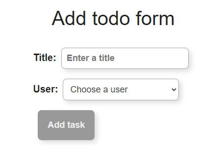

# Todo App

This project was developed as part of the Mate Academy task and React exercises. The goal was to create a todo application with an enhanced form featuring improved styles.

## Features

- **Add Todo**: The application allows users to add new tasks with a title and user selection.

## Code Structure

The main application logic is contained in the `App.tsx` file. Key features include:

- Form handling for adding new todos.
- Integration with external APIs to fetch users and todos.
- Styling using SCSS to enhance the visual appeal.

## Components

### TodoList

The `TodoList` component is responsible for rendering the list of todos.

## Contributing

If you'd like to contribute to this project, feel free to fork the repository and submit a pull request.

---

Happy coding!
